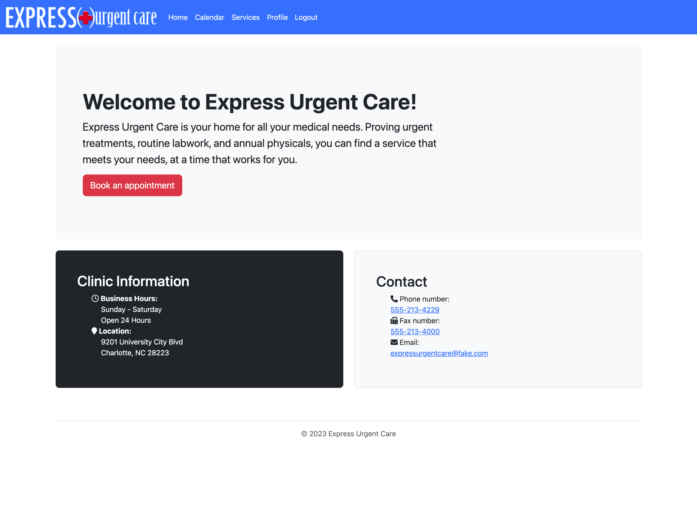
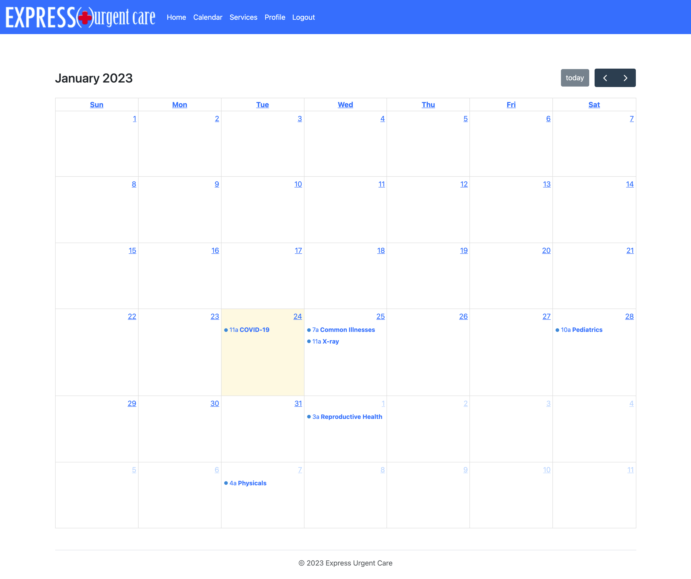

# Express Urgent Care

Express Urgent Care is a website that provides information to the patients about Express Urgent Care and gathers information from the patients before they even make it to the clinic.

The main goal of the website is to make it easier for the patients to book an appointment.  The website will also provide the available time slot and the services Express Urgent Care provides.  

## Table of Contents
- [Description](#description)
- [Contributors](#contributors)
- [Instructions](#instructions)
- [Technologies](#technologies)
- [Link](#link)
- [Visuals](#visuals)

## Description

The user interface of Express Urgent Care is easy to navigate.  On the navbar of every page, as well as a button on the home page, you will have the option to view the appointment calendar. On the calendar, you may view avaliable times and book an appointment directly. The services tab gives patients information on the type of service Express Urgent Care provides and the illnesses that are treated. Through the login options, users may log in, or be given the option to create a new account.  The patient will be able to give their basic information like name, email, telephone number etc.  Once the patient has signed up, the data will be stored and won't require to be filled in again.

## Contributors

This project is proudly presented by Mason Marcantel, Ashley, Whitlehunt, Henry Moraille, and Erin Bowen.

## Instructions

To use the website effectively the patient needs to register an account. To register the patient needs to click on:
1) Login navbar button
2) Sign up instead
3) User will fill in the sign up form
4) Click on the register button

If the patient is already reigistered they need to click on:
1) Login navbar button
2) Submit their username and password
3) Patients will be redirected to the home page. From there, they may use the home page's "book an appointment" button, or the navbar's "calendar" button

For a patient to book an appointment they must be on the calendar page:
1) The patient will click on the day which they wish to make an appointment
2) Patient will be prompted to select a service from a drop-down list
3) Patient will select a date and time for their appointment
4) Patients will click the submit button

## Technology

This website uses technolgies such as Node.js, Bcrypt, Sequelize, Dayjs, Dotenv, Express, Handlebars, Session, Mysql2, Sequelize, FullCalendar.io and Bootstrap.

## Link

[Website](https://enigmatic-tundra-51864.herokuapp.com/)

## Visuals

